# CI/CD Workflow Diagrams

This README documents the three GitHub Actions workflows using Mermaid diagrams. It includes:
- A flowchart for ci-merge-dev, ci-pr-dev-open and cd-merge-main.
- A high-level sequence diagram spanning CI and CD workflow
- An simple end-to-end integration and deployment flow

## Flowcharts
### `ci-pr-dev-open.yml`

### `ci-merge-dev.yml`

### `cd-merge-main.yml`

```mermaid
flowchart TD
    trig_0(["Trigger: merge on main"])
    deploy{"Job: deploy"}
    subgraph deploy_steps[Steps for deploy]
        deploy_s0["Azure login"]
        deploy_s1["Install Azure CLI extensions"]
        deploy_s0 --> deploy_s1
        deploy_s2["ACR login + derive repo path"]
        deploy_s1 --> deploy_s2
        deploy_s3["Resolve tag or accept digest"]
        deploy_s2 --> deploy_s3
        deploy_s4["Ensure multi-revision (blue/green) mode"]
        deploy_s3 --> deploy_s4
        deploy_s5["Update image → create new revision"]
        deploy_s4 --> deploy_s5
        deploy_s6["Short wait (no health endpoint yet)"]
        deploy_s5 --> deploy_s6
        deploy_s7["Shift 100% traffic to new revision"]
        deploy_s6 --> deploy_s7
        deploy_s8["Output"]
        deploy_s7 --> deploy_s8
    end
    deploy --> deploy_s0
    trig_0 --> deploy
```

## Cross-Workflow Sequence

## End-to-End Flow

---

> Generated with the help of ChatGPT